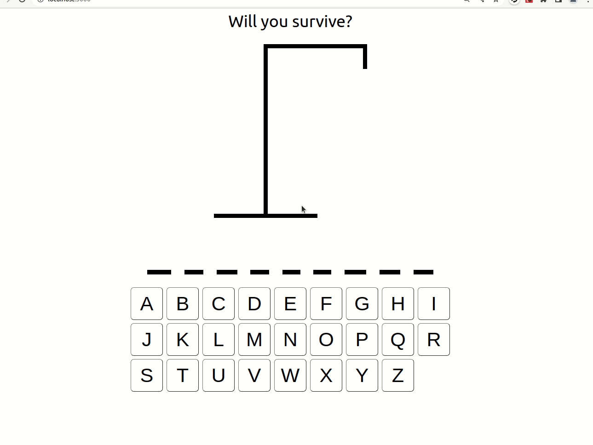

# Hangman

This project was bootstrapped with [Create React App](https://github.com/facebook/create-react-app).

## Play Here
[Hangman](https://teddygavi.github.io/react-hangman/)

## Information
- I used [Web-Dev Simplified](https://www.youtube.com/watch?v=-ONUyenGnWw&t=1804s) as a inspiration and teaching aid when creating this simple project

- Use your keyboard or your mouse to select letters in an attempt to guess the word

## Goals
- Increase the "dictionary" size
- Allow for varying difficulties
- Link to a DB to store records of a users attempts
- no mobile testing done? who knows about that?

> Let me know if it stinks